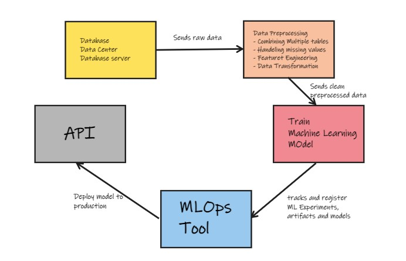

# Workflow Orchestration 🌊

**Workflow Orchestration** is a set of tools which schedule and monitor the work which we want to accomplish in our work pipelines.

Ummmmmm the definition does give us a brief overview of what it is but is it really necessary ? 

## What's the need 🤔?

Let's understand the same with a following example,

Take a look at this **Machine Learning Piepline**

In an ideal world, this works life a charm ╰(*°▽°*)╯ but in our real world things don't go as expected (┬┬﹏┬┬)

You may ask what could go wrong in such a beautiful ML pipeline ?

* Oops, sent wrong data from our **Data Centre** leading in failure of data preprocessing stage e.g. `imputer.transform()` fails as unexpected data comes 🤦‍♂️🤦‍♀️
* Well data was almost preprocessed properly but mistakenly new intern forgot to remove `target` column in our data 😡, Leading in failure of our Machine learning model
* Since Model build failed, no model was registered into our Model Registry so no model for deployment 😭
* Well we managed to solve all the problems and deployed our model using a `Flask API` but Ooopssss ..... due to some reason API went down 💤

Well there's a lot of such scenarios which one has to consider to keep our pipeline intact and if something fails we manually have to correct all of that which is 
arggghh bit of frustrating and time consuming 

All such things mentioned above are part of 
## Negative Engineering

> Negative engineering is the time-consuming and sometimes frustrating work that engineers undertake to ensure the success of their primary objectives 
[source](https://future.com/negative-engineering-and-the-art-of-failing-successfully/#:~:text=Negative%20engineering%20is%20the%20time,success%20of%20their%20primary%20objectives.)

These are the kind of things where we as a developer spent a lot of our time 

So this is where **Workflow orchestration** comes in which automates this process of **monitoring** pipeline failures and also handels what must be done in such scenarios
