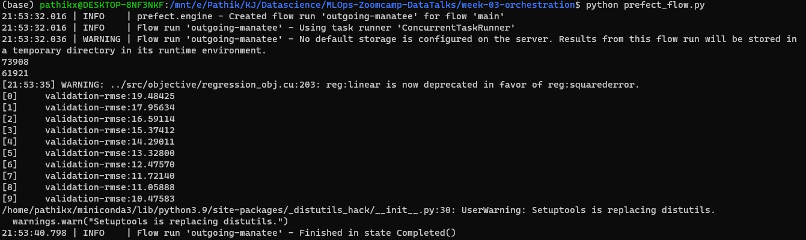
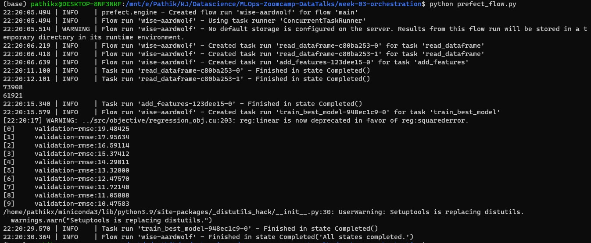
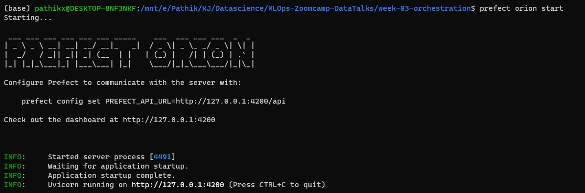
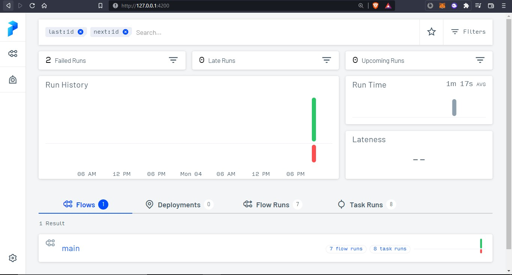
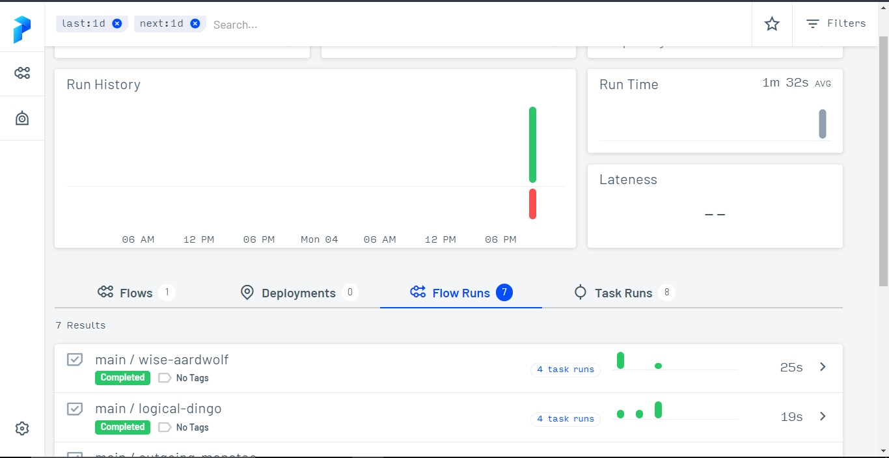
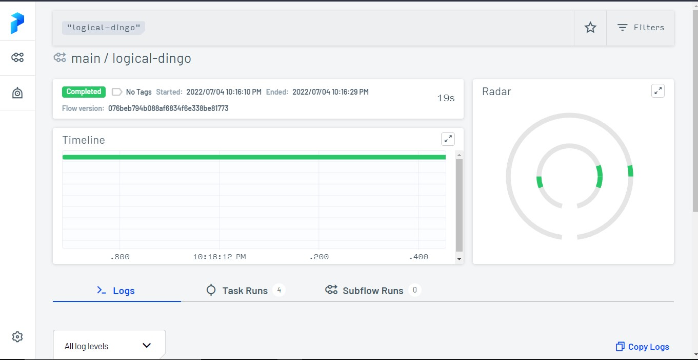
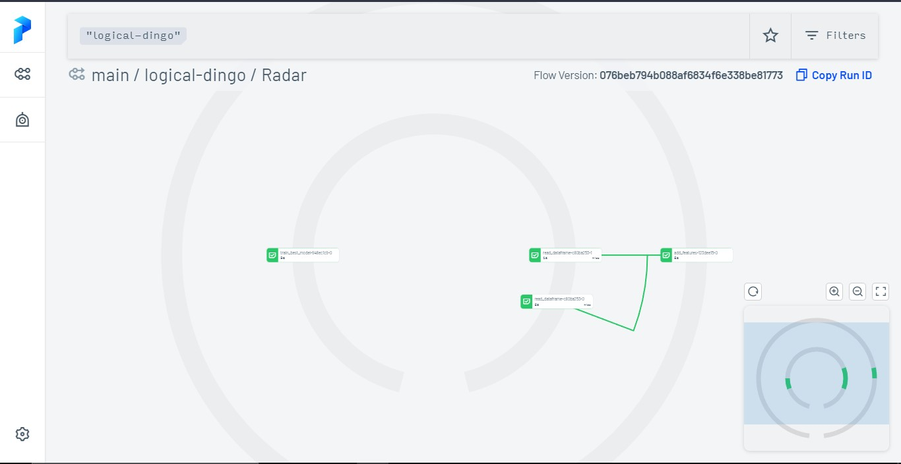

# 

[Prefect](https://www.prefect.io/) is a tool that enables us to build, run, and monitor data pipelines at scale.

# Installation 

Installing the latest version

```bash
pip install -U "prefect>=2.0b"
```

# Usage

To demonstrate its usage, I will be using the code from [experiment-tracking](/week-02-experiment-tracking/) module
but first the code in the jupyter notebook needs to be converted into script since we will be using scripts in production environment

Though, Jupyter notebooks can we be used in production but they've their pros and cons 
I found this nice [article](https://neptune.ai/blog/should-you-use-jupyter-notebooks-in-production) which explains a lot on the same

Reformatted script can be found [here](MLOps-Zoomcamp-DataTalks/week-03-orchestration/model_training.py/)

## Let's get started 🥳

### imports

```python
from prefect import flow, task
```

Prefect has two main components flow and task,

### flow 
Flows are the most basic Prefect object. They are containers for workflow logic and allow users to interact with and reason about the state of their workflows  
**In short, it contains the whole logic of our code/workflow**


e.g. In our use case, we can include the whole logic in a single function say `main()` and then adding a decorator `@flow` 

```python
@flow
def main(train_path: str = "./data/green_tripdata_2021-01.parquet",
         val_path: str = "./data/green_tripdata_2021-02.parquet"):
    mlflow.set_tracking_uri("sqlite:///mlflow.db")
    mlflow.set_experiment("nyc-taxi-experiment")
    X_train = read_dataframe(train_path)
    X_val = read_dataframe(val_path)
    X_train, X_val, y_train, y_val, dv = add_features(X_train, X_val)
    train = xgb.DMatrix(X_train, label=y_train)
    valid = xgb.DMatrix(X_val, label=y_val)
    # train_model_search(train, valid, y_val) for testing lets not use this :)
    train_best_model(train, valid, y_val, dv) 
 ```

and we can simply call our `main()` function when the script runs

#### Running the flow 

Let's see what do we see in the output :



With the model training, we also get to see that **Prefect** create a **flow run** named 'powerful-ibis' for flow 'main'   
btw we can also specify a **name** to our flow run by passing `name` as an argument in `@flow()`  

(I know doesn't seem that interesting at start but something's hiding beneath it ;) which we will explore sooon....)

### task

A task is a function that represents a discrete unit of work in a Prefect workflow.
Tasks are functions: they can take inputs, perform work, and return an output. A Prefect task can do almost anything a Python function can do.


e.g. we can add `@task` to our function `read_dataframe`

```python
@task
def add_features(df_train, df_val):
   ...
   return X_train, X_val, y_train, y_val, dv
```

Each task calls return a `PrefectFuture`, which represents the status of a task executing in a task runner

If we have multiple variables in our return statement then to get the results, we need to call method `.result()` on our task call 
i.e. 
`X_train, X_val, y_train, y_val, dv = add_features(X_train, X_val).result()`

Similarly we can assign these tasks to our other functions as well

#### Running the flow

This time if we run then flow then,



In the output we can see that, we get some information about `tasks` like when our **task run** started and ended in the **flow run**...  
(we can specify name to each of the tasks by passing `name` as a parameter in the decorator `@task`)

### Prefect UI

The Prefect UI provides an overview of all of your flows

To access the UI,
we can simply do :
`prefect orion start`



which setups a dashboard at address : `http://127.0.0.1:4200/`



NICE !
BUT 


HOW THA HECK `main` CAME INTO `Flow` ?
We never specified anything to keep track of our flows right ? except adding `@flow` and `@task` 
That's the beauty of `Prefect` that it automatically keeps track of everything about our flows in the backend... 🐱


#### Flows runs

Let's explore what's hidden inside `Flow runs` 



Selecting 2nd flow run, 



as we can see we get to see a lot of information about our flow,  
e.g.  
* status
* tags
* timeline
* start and end time
* logs
* task runs
* radar map

Wooo what's this `radar map` ?  
Let's click ...   



Wooh, now we can have a look at our workflow visually ...   
e.g. we can also see flow of our data from one task to another  

Pretty Cool 👏


 
